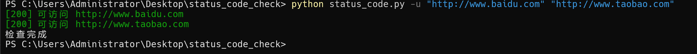
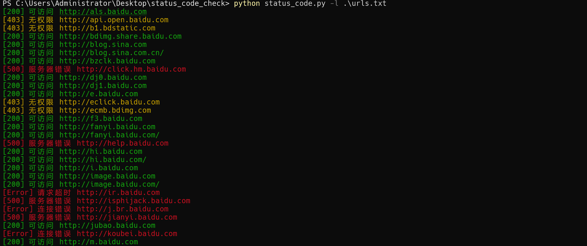
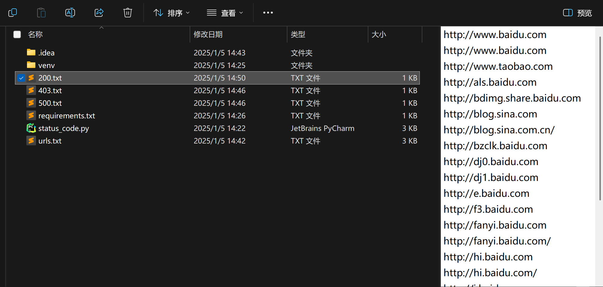

# 📄简介
一款使用python3.10编写的检测网站状态码的工具, 支持批量检测HTTP状态码, 不同的状态码会以不同的颜色打印在控制台, 并且在程序运行过程中会对检测结果进行分类, 把不同状态码的地址保存到对应的txt文件

- code = 200 ---> 200.txt
- code = 403 ---> 403.txt
- code = 404 ---> 404.txt
- code = 500 ---> 500.txt
- . . .

## 安装依赖
```
pip install -r requirements.txt
```

## 查看帮助
```
> python status_code.py -h
usage: status_code.py [-h] [-l LIST] [-u URL [URL ...]]

URL状态码检查工具

options:
  -h, --help            show this help message and exit
  -l LIST, --list LIST  包含网站列表的文件
  -u URL [URL ...], --url URL [URL ...]
                        一个或多个网站URL
```

# ✨效果

> 注意‼️ 需要在域名前面指定协议 http:// 或者 https://
## 使用 -u 参数 指定URL 


## 使用 -l 参数 指定包含URL文件


## 不同的状态码会被分类保存到对应的txt文件中

